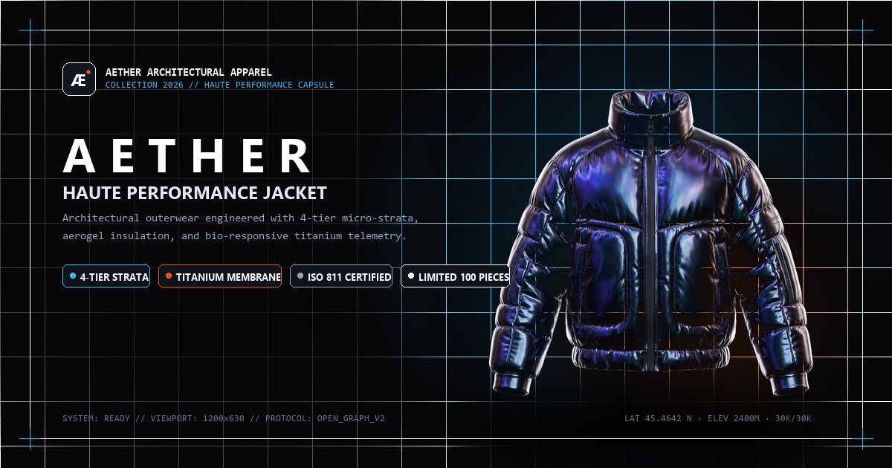

# ÆTHER // HAUTE PERFORMANCE JACKET
### Bespoke Architectural Outerwear & Cyber-Luxury 3D Storefront

<div align="center">

[](https://leodevdesign.github.io/jaqueta-e-commerce/)
[](https://leodevdesign.github.io/jaqueta-e-commerce/)
[](https://nextautomatik.com)

<br>

<!-- Technology Badges / Bandeirinhas -->
[](https://developer.mozilla.org/en-US/docs/Web/HTML)
[](https://developer.mozilla.org/en-US/docs/Web/CSS)
[](https://developer.mozilla.org/en-US/docs/Web/JavaScript)
[](https://threejs.org/)
[](https://www.khronos.org/webgl/)
[](https://www.blender.org/)
[](https://greensock.com/gsap/)
[](https://tailwindcss.com/)
[](https://developer.mozilla.org/en-US/docs/Web/API/Web_Audio_API)
[](https://lucide.dev/)
[](https://pages.github.com/)
[](https://nodejs.org/)

<br><br>



<br>

<p align="center">
  <b>🌐 Link do Projeto Online:</b> <a href="https://leodevdesign.github.io/jaqueta-e-commerce/">https://leodevdesign.github.io/jaqueta-e-commerce/</a>
</p>

</div>

---

## 💎 Visão Geral do Projeto

O **AETHER** é uma experiência web de comércio eletrônico de alta costura e estética cibernética/luxo (*haute-performance architectural apparel*). Inspirado em lançamentos de ponta (Balenciaga, Arc'teryx Veilance, Apple), o projeto combina renderização 3D em tempo real no navegador com WebGL, animações fluidas baseadas em física de rolagem e design responsivo de padrão internacional.

O site foi inteiramente construído com tecnologias web puras e leves (**HTML5, CSS3, JavaScript ES6+, Three.js e GSAP**), permitindo carregamento ultra-rápido, taxa de quadros consistente em 60 FPS e hospedagem estática direta via **GitHub Pages**.

---

## 🛠️ Tecnologias & Ferramentas Utilizadas

### 1. 🎨 Pipeline 3D & Blender
* **Blender 3.6+**:
  * **Modelagem & Escultura Digital**: Desenvolvimento da jaqueta com dobras anatômicas, gola estruturada, bolsos táticos e zíperes reforçados.
  * **Simulação de Tecido & Extração de Mapas**: Geração de texturas de alta fidelidade:
    * *Diffuse/Albedo Texture*: Iridescência e variações cromáticas do tecido Ripstop japonês.
    * *Normal Maps*: Micro-relevos de costura, trama do ripstop e detalhes metálicos dos zíperes.
    * *Depth / Displacement Maps*: Volumetria profunda para deslocamento procedural em tempo real.
  * **Geração de Modelos GLB/glTF**:
    * Exportação e otimização dos 4 modelos da coleção (`jacket_blue.glb`, `jacket_orange.glb`, `jacket_lime.glb`, `jacket_pink.glb`).
    * Setup de iluminação de estúdio (Key, Fill, Rim lights e ambient occlusion).

### 2. ⚡ Gráficos 3D em Tempo Real (Three.js & WebGL)
* **Three.js r128**:
  * **Shader Físico PBR (`MeshPhysicalMaterial`)**: Materiais avançados com camada de verniz (*clearcoat*), aspereza (*roughness*), metalicidade (*metalness*), mapas normais e deslocamento volumétrico dinâmico de vértices.
  * **Iluminação Direcional Dinâmica**: Key light polarizada, luz de contorno ciano (#38bdf8) e luz de borda violeta (#a855f7), com luz pontual de brilho especular rastreando o cursor do mouse.
  * **Múltiplos Viewports 3D Independentes (Coleção)**: Quatro instâncias 3D isoladas na Seção 3 com `OrbitControls`, rotação 360°, amortecimento inercial (*inertia damping*) e seletor cromático.
  * **Ancoragem Espacial na Seção 5**: Cálculo de projeção da câmera 3D que desloca a jaqueta principal suavemente do centro para dentro de uma moldura técnica de telemetria conforme a rolagem.

### 3. 🎬 Animações & Orquestração (GSAP)
* **GSAP (GreenSock Animation Platform 3.12)**:
  * Linhas do tempo coordenadas para entrada de tela e revelações de elementos.
  * **Preloader Minimalista**: Vetor SVG desenhado progressivamente com contorno nítido (`stroke-dasharray`), seguido pelo preenchimento luminoso varrido da esquerda para a direita.
  * **Transição Cinematográfica do Logo**: Ao completar o carregamento, o logotipo `AETHER` diminui de tamanho e viaja dinamicamente para o canto superior esquerdo até o cabeçalho, enquanto uma cortina preta se eleva revelando a cena 3D.
  * **Choreografia de Rolagem Personalizada**: Interpolação suave (*lerp*) baseada na distância de scroll, garantindo sincronização sem engasgos.

### 4. 🎛️ Efeitos Sonoros com Web Audio API
* **Síntese Sonora Programática**:
  * Geração de áudio 100% via código com osciladores senoidais e filtros passa-baixa, sem necessidade de carregar arquivos de áudio externos (`.mp3` ou `.wav`).
  * Cliques hápticos de alta frequência ao selecionar cores, abrir sanfonas técnicas ou ao pousar o logo do preloader.

### 5. 📱 Design Responsivo & Glassmorphism
* **Tailwind CSS & CSS3 Avançado**:
  * Cores personalizadas de ultra-luxo: `#070709` (Pitch Black), `#0e1014`, `#38bdf8` (Cyan Blue), `#fb923c` (Tangerine Orange).
  * **Design Glassmorphism de Alta Densidade**: Cartões com `backdrop-filter: blur(20px)`, bordas sutis translúcidas e sombras profundas.
  * **Experiência Mobile Exclusiva**:
    * Ao abrir no smartphone (`scrollY === 0`), exibe **apenas a jaqueta 3D** no centro com impacto visual absoluto.
    * Conforme o usuário rola a tela, os cartões técnicos surgem suavemente com fundo de vidro protetor sobre a jaqueta, garantindo máxima legibilidade.
  * **Cursor Personalizado & Glow**: Retículo duplo animado por física de mola e brilho atmosférico de 340px que acompanha o mouse no desktop.

---

## 📐 Estrutura do Repositório

```text
jaqueta-e-commerce/
├── assets/
│   ├── 3d/                     # Modelos 3D otimizados (.glb)
│   │   ├── jacket_blue.glb
│   │   ├── jacket_lime.glb
│   │   ├── jacket_orange.glb
│   │   └── jacket_pink.glb
│   ├── icons/                  # Ícones e favicons (SVG, PNG)
│   │   ├── favicon.svg
│   │   ├── favicon-32.png
│   │   ├── favicon.png
│   │   └── apple-touch-icon.png
│   └── images/                 # Texturas, mapas PBR e imagens sociais
│       ├── jacket-cutout.png
│       ├── jacket-normal.png
│       ├── jacket-depth.png
│       ├── jacket-exploded-layers.png
│       └── og-share-aether.png
├── css/
│   └── style.css               # Folha de estilo de luxo, variáveis e responsividade
├── js/
│   ├── app.js                  # Orquestração geral, áudio, GSAP e interatividades
│   ├── jacket3d.js             # Motor Three.js da Jaqueta 3D Principal (Hero/Details/Specs)
│   └── collections3d.js        # Motor Three.js dos 4 viewports 3D independentes (Catalog)
├── index.html                  # Estrutura semântica completa e meta tags Open Graph
├── serve.js                    # Servidor local Node.js com MIME types e no-cache
└── README.md                   # Documentação oficial do projeto
```

---

## 🚀 Como Executar Localmente

### Pré-requisitos
* [Node.js](https://nodejs.org/) instalado na máquina (versão 16 ou superior).

### Passo a passo

1. **Clone o repositório:**
   ```bash
   git clone https://github.com/leodevdesign/jaqueta-e-commerce.git
   cd jaqueta-e-commerce
   ```

2. **Inicie o servidor de desenvolvimento:**
   ```bash
   node serve.js
   ```

3. **Acesse no seu navegador:**
   ```text
   http://127.0.0.1:8088/
   ```

---

## 🌐 Deploy em Produção

O projeto está publicado e disponível publicamente no **GitHub Pages**:
* 🔗 **Acesso Online**: [https://leodevdesign.github.io/jaqueta-e-commerce/](https://leodevdesign.github.io/jaqueta-e-commerce/)
* 📦 **Repositório**: [https://github.com/leodevdesign/jaqueta-e-commerce](https://github.com/leodevdesign/jaqueta-e-commerce)

---

## 🖋️ Créditos & Autoria

* **Desenvolvimento & Criação**: [Next Automatik](https://nextautomatik.com)
* **Direção de Arte & Modelagem 3D**: Atelier AETHER & Next Automatik
* **Copyright**: © 2026 AETHER Architectural Apparel · Todos os direitos reservados.
